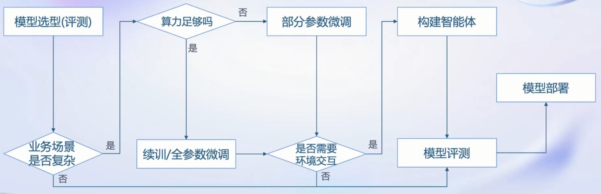
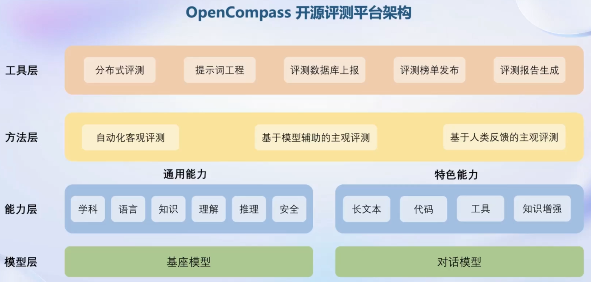
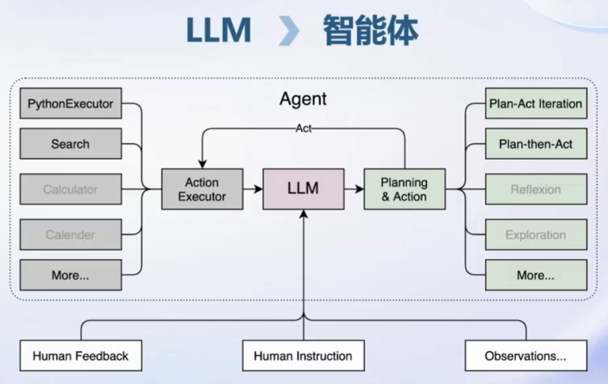

## LLM全链条体系

LLM在某个具体业务场景下的应用部署流程如下所示：

### 数据

在数据方面，书生·万卷1.0语料库包括2TB的多模态数据，包含文本、图像和视频，这些语料涵盖多个领域的相关知识。除此之外，还有OpenDataLab数据平台，提供了更多的通用数据，以及扩展了包括语音和三维模型这些新模态的数据。

### 预训练

训练工具在可变数量的GPU上的可扩展性高，并行优化的性能较强，最主要的是对主流技术生态兼容性很高。

### 微调

在将LLM进行微调以用于下游应用时，有两种方式：增量续训和有监督微调。前者侧重于让模型学习到新的垂类领域知识，后者则期望让模型理解和遵循各种指令。在有监督微调中，一种加速的方式是将预训练模型的权重参数固定，额外引入一些较小的新的可训练参数进行部分参数微调。

XTuner对多种生态和多种硬件的适配性较好。

### 部署

LLM在部署上可能遇到的问题在于模型参数量巨大和为了缓存token的k/v所导致的内存压力、请求数量不固定以及每次请求的token数量不固定所导致的动态shape问题。这使得部署时需要考虑如何有效利用和管理内存、如何加速token的生成速度以及如何解决动态shape，让推理不间断几个方面的问题。一些可行的技术方案包括模型并行、低比特量化、Attention优化、计算和访存优化以及持续批处理等。

LMDeploy部署工具具有高效的推理引擎和完备易用的工具链，提供多种语言的接口，以及和主流接口高度兼容的API server。

### 评测

国内外的评测体系一般使用由大量问答题目组成的数据集，评测类型包含主观评测和客观评测两种，如HELM、FlagEval、MMLU、Alpaca Eval、SuperCLUE和OpenLLM Leaderboard等。

OpenCompass评测体系包含对LLM在学科、语言、知识、理解、推理和安全这六个维度的评测数据，含有较多的评测题目，其体系架构如下所示：

### 应用

LLM在最新信息和知识的获取、回复的可靠性、数学计算和工具使用和交互四个方面存在局限性。为了应对更复杂的应用场景，需要搭建以LLM为核心的智能体去进行规划、推理和执行动作。一个智能体的架构如下所示：

Lagent支持多种类型的智能体能力，灵活支持各种大语言模型，对多种工具提供支持。而AgentLego则提供了更加丰富的工具集合。

